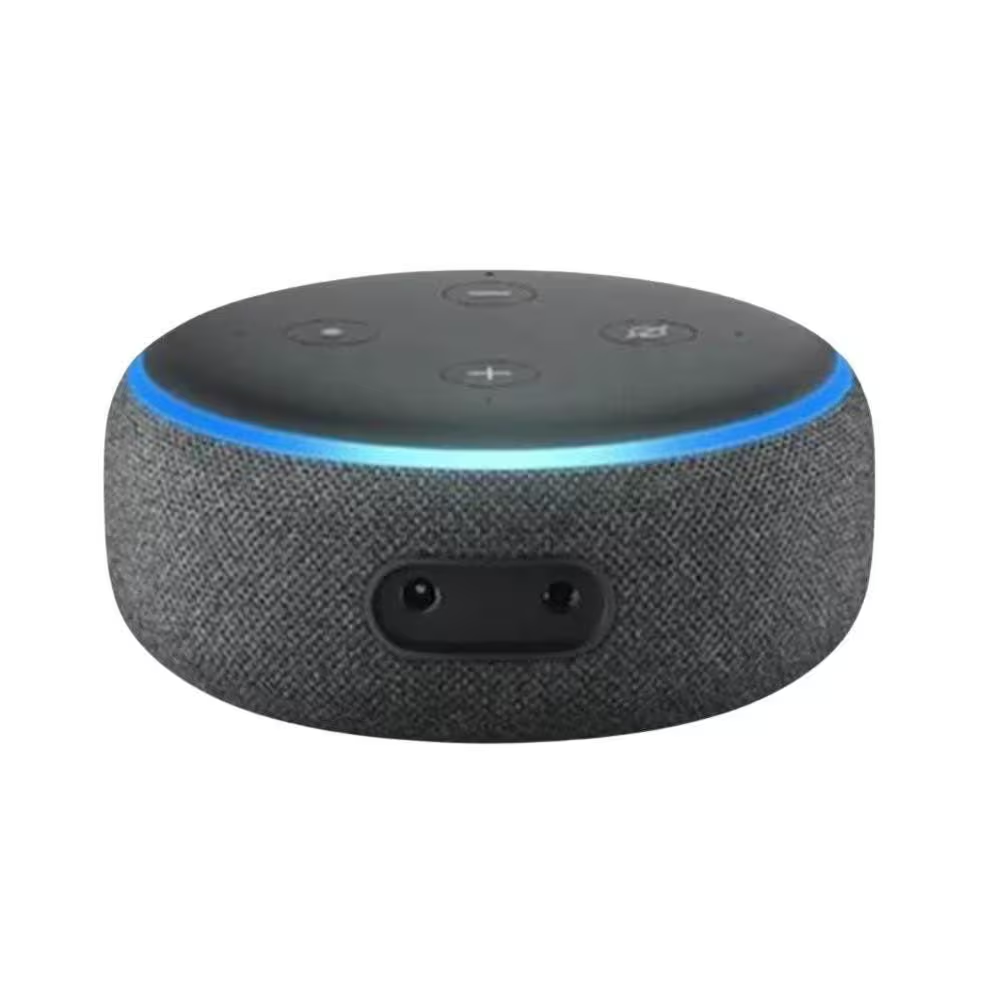

# Evolução da Interação Humano-Computador (IHC)

## Como era a Interação Humano-Computador por volta de 1970?
Na década de 1970, a interação entre humanos e computadores era bastante limitada e técnica. Os computadores eram acessados principalmente por meio de terminais de texto, sem interface gráfica. 

A entrada de dados era feita por linha de comando ou até mesmo por cartões perfurados, exigindo conhecimento especializado em programação. 

A comunicação era unidirecional: o humano dava comandos e o computador devolvia respostas em texto simples. Nessa época, o foco estava na eficiência da máquina, não na experiência do usuário.

## E de aproximadamente 1980 até 2007?
Esse período foi marcado pela popularização dos computadores pessoais (PCs) e o surgimento das Interfaces Gráficas do Usuário (GUIs). 

### Computador dos anos 80

Com sistemas como Mac OS (1984) e Windows (a partir de 1985), a interação se tornou mais acessível, com ícones, menus, janelas e o uso do mouse. A partir dos anos 1990, a internet também começou a transformar a IHC, exigindo novas formas de navegação e interação. 

### Computador dos anos 90
 

Surgiram também dispositivos móveis básicos (como PDAs e celulares), mas com interfaces ainda limitadas. A IHC passou a se preocupar mais com a usabilidade e o design centrado no usuário.

## E de 2007 até agora?
O ano de 2007 marcou um divisor de águas com o lançamento do iPhone, que consolidou o uso de telas sensíveis ao toque e introduziu uma nova era de dispositivos móveis inteligentes. 

A interação passou a ser feita com gestos, toques, voz, e os sistemas ficaram mais contextuais e personalizados. Surgiram assistentes virtuais como Siri, Alexa e Google Assistente, além da integração com inteligência artificial. 

Aplicações de realidade aumentada (AR) e realidade virtual (VR) também começaram a se popularizar. A IHC atual é multimodal, ou seja, envolve múltiplas formas de interação simultaneamente.

### Imagem retratando a evolução dos computadores

## Qual o futuro da IHC?
O futuro da IHC aponta para interfaces ainda mais naturais, imersivas e inteligentes. Espera-se avanços em:

- Interface cérebro-computador, permitindo controlar sistemas com o pensamento;

- Realidade mista, fundindo AR e VR em experiências contínuas;

- Interações baseadas em emoções, com sistemas que interpretam expressões faciais, voz e comportamento;

- Ambientes ubíquos, onde a tecnologia estará embutida em objetos do cotidiano (IoT);

- IA altamente personalizada, capaz de antecipar necessidades do usuário.

A tendência é que a tecnologia desapareça do foco da atenção e a interação se torne mais fluida, natural e integrada ao ambiente.

### Alexa

Sistema que permite gerenciar vários aparelhos/computadores na rede, por comando de voz.